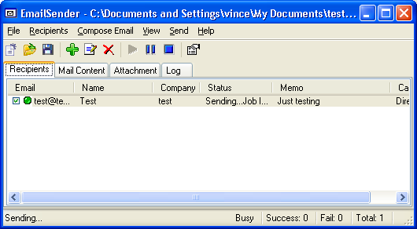
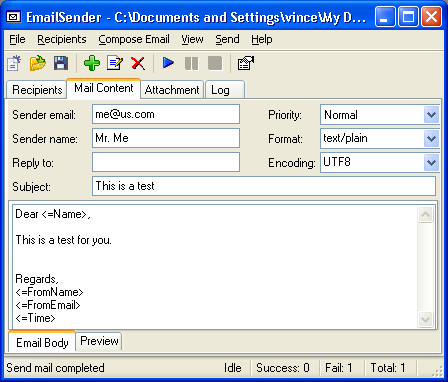
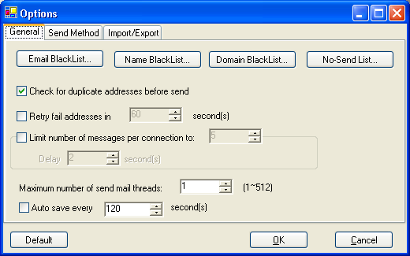

<div align="center">

# 📧 EmailSender

**A lightweight Windows desktop application for personalized bulk e-mail campaigns.**

Import your recipients, compose a message with merge fields, configure one or more SMTP servers, and send — with full start / pause / resume / stop control over the background sending job.

[](LICENSE)
[](https://dotnet.microsoft.com/download/dotnet-framework/net48)
[](#requirements)
[](#)
[](https://github.com/jstedfast/MailKit)

</div>

---

## Table of contents

- [Screenshots](#screenshots)
- [Features](#features)
- [Requirements](#requirements)
- [Getting started (users)](#getting-started-users)
- [Building from source](#building-from-source)
- [Running the tests](#running-the-tests)
- [Usage guide](#usage-guide)
  - [1. Import recipients](#1-import-recipients)
  - [2. Compose the message](#2-compose-the-message)
  - [3. Configure how mail is sent](#3-configure-how-mail-is-sent)
  - [4. Send, pause, resume, stop](#4-send-pause-resume-stop)
- [File formats](#file-formats)
- [Personalization tokens](#personalization-tokens)
- [Project structure](#project-structure)
- [Contributing](#contributing)
- [License](#license)
- [Acknowledgements](#acknowledgements)

---

## Screenshots

| Recipients | Mail Content | Options |
|:---:|:---:|:---:|
|  |  |  |

---

## Features

- **Personalized mass mailing** — merge recipient fields (name, company, etc.) into the subject and body with simple `<=Token>` placeholders.
- **Three delivery modes:**
  - **SMTP** — modern, secure delivery via [MailKit](https://github.com/jstedfast/MailKit), with **implicit SSL/TLS** and **STARTTLS** support and SMTP authentication.
  - **MAPI** — hand the message to the local mail client. Note that this is *discontinued* on Windows 11!
  - **Direct** — deliver straight to the recipient's mail server via DNS MX lookup.
- **Multiple SMTP servers** — distribute a campaign across several servers, with per-server message limits and automatic fail-over to the next enabled server.
- **Robust send-job control** — safely **start, pause, resume, and stop** the background sending thread at any time (backed by a proper thread-synchronization gate, not a busy-wait).
- **Throttling** — limit messages per connection and insert configurable delays between batches. Note: Depending on your mail provider, it can be necessary to limit the throughput when sending mails. There are email providers that are known to allow only 60 mail per hour! Even if you are hosting a server yourself, it is a good idea to throttle so you dont get blacklistet by relays or receivers mail providers.
- **Recipient filtering** — name, e-mail, domain blacklists, a no-send list, duplicate detection, and e-mail-address validation.
- **Automatic retry** of failed recipients after a configurable interval.
- **Import & export** address books in vertical-text, comma/tab-delimited, XML, and e-mail-only formats.
- **HTML or plain-text** bodies with a live preview tab.
- **Attachments** support.

---

## Requirements

| | |
|---|---|
| **Operating system** | Windows (Windows Forms, MAPI, and the WebBrowser preview control are Windows-only) |
| **Runtime** | [.NET Framework 4.8](https://dotnet.microsoft.com/download/dotnet-framework/net48) |
| **To build** | Visual Studio 2022 *or* the .NET Framework 4.8 build tools (MSBuild) |
| **Bundled dependencies** | [MailKit](https://www.nuget.org/packages/MailKit) 4.17 and [MimeKit](https://www.nuget.org/packages/MimeKit) 4.17 (restored automatically from NuGet) |

> ⚠️ **Responsible use.** This tool sends bulk e-mail. Only mail people who have agreed to hear from you, honor unsubscribe requests, and comply with anti-spam laws such as the GDPR, the CAN-SPAM Act, and your provider's terms of service.

---

## Getting started (users)

1. Download the latest build from the [Releases](https://github.com/Thomas-Mielke-Software/EmailSender/releases) page (or build it yourself — see below).
2. Make sure **.NET Framework 4.8** is installed (it ships with Windows 10 1903+ and Windows 11).
3. Run `EmailSender.exe`.

Prefer to build it yourself? Read on.

---

## Building from source

Clone the repository:

```bash
git clone https://github.com/Thomas-Mielke-Software/EmailSender.git
cd EmailSender
```

### Option A — Visual Studio (recommended)

1. Open **`EmailSender.sln`** in Visual Studio 2022.
2. Visual Studio restores the NuGet packages automatically on first load.
3. Select the **Debug** or **Release** configuration and press **F6** (Build) or **F5** (Run).

### Option B — Command line (MSBuild)

From a *Developer Command Prompt* / *Developer PowerShell for VS*:

```powershell
# Restore NuGet packages, then build the whole solution
msbuild EmailSender.sln /t:Restore
msbuild EmailSender.sln /p:Configuration=Release
```

The application is produced at:

```
EmailSender/bin/Release/EmailSender.exe
```

> 💡 To build only the application (skipping the test project):
> ```powershell
> msbuild EmailSender/EmailSender.csproj /t:Restore;Build /p:Configuration=Release
> ```

### Creating the installers

The Windows installer is built with [Inno Setup 6](https://jrsoftware.org/isinfo.php) (6.3 or newer). The [`bump-version.ps1`](bump-version.ps1) script raises the version in `AssemblyInfo.cs`, mirrors it into [`EmailSender.iss`](EmailSender.iss), builds the Release output, compiles the installer into `Setup/`, and creates a git commit + tag `vX.Y.Z`:

```powershell
# Increase the version (major | minor | patch), build, package, commit + tag
.\bump-version.ps1 -Part patch

# ...and push the commit and tag as well
.\bump-version.ps1 -Part minor -Push

# Preview the version change only (no write, build or git)
.\bump-version.ps1 -Part patch -DryRun
```

Because EmailSender is an AnyCPU .NET Framework application, a **single installer covers x86, x64 and ARM64** — the managed binaries are architecture-neutral, so no per-architecture build is needed. The produced executables are **not signed** unless a sign tool is enabled (the `SignTool` line in `EmailSender.iss`); configure your own in the Inno Setup IDE.

---

## Running the tests

The `UnitTests` project uses **NUnit 3** with the **NUnit3TestAdapter** and the **Microsoft.NET.Test.SDK**.

### In Visual Studio

Open **Test ▸ Test Explorer** and run all tests (`Ctrl+R, A`). The tests run on an STA thread (required by the form's WebBrowser control) automatically.

### From the command line

```powershell
# Build the test project (this also builds the app it references)
msbuild UnitTests/UnitTests.csproj /t:Restore;Build /p:Configuration=Debug

# Run the tests with VSTest
vstest.console.exe UnitTests/bin/Debug/UnitTests.dll `
  /TestAdapterPath:"$env:USERPROFILE\.nuget\packages\nunit3testadapter\4.5.0\build\net462" `
  /Platform:x86
```

---

## Usage guide

### 1. Import recipients

Use **Recipients ▸ Import External File…** and pick the matching file type. Imported contacts appear in the **Recipients** tab, where you can check/uncheck individuals, edit them, or remove duplicates. See [File formats](#file-formats) for the exact layouts.

### 2. Compose the message

On the **Mail Content** tab, fill in the *Sender email*, *Sender name*, *Reply to*, *Subject*, and body, and choose the *Priority*, *Format* (`text/plain` or `text/html`), and *Encoding*. Insert [personalization tokens](#personalization-tokens) (via the **Compose Email** menu) to merge per-recipient data. Add files on the **Attachment** tab, and switch the body's **Preview** sub-tab to render the result.

### 3. Configure how mail is sent

Open **View ▸ Options** to choose the delivery mode (**SMTP**, **MAPI**, or **Direct**), define one or more SMTP servers (host, port, SSL/TLS or STARTTLS, credentials, per-server limits), set throttling and retry behavior, and manage the recipient filters.

> 💡 Note that MAPI is *discontinued* on Windows 11!
> This option is only available in case you use older and no longer supported versions of Windows (not recommended) or Wine environments (not even tested).

### 4. Send, pause, resume, stop

Drive the campaign from the toolbar or the **Send** menu:

| Action | What it does |
|---|---|
| ▶ **Start** | Begins (or resumes) sending the checked recipients on a background thread. |
| ⏸ **Pause** | Cleanly halts after the current message; queued recipients are marked *Paused*. |
| ▶ **Start** (while paused) | Resumes exactly where it left off. |
| ⏹ **Stop** | Aborts the job; the UI returns to idle. |

The status bar tracks success / failure / total counts live, and every action is written to the **Log** tab.

---

## File formats

EmailSender imports and exports the following layouts.

### Vertical text (`*.txt`)

Contacts are separated by at least one blank line; each labeled field is on its own line. Lines whose label is not recognized are ignored. **Labels are case-sensitive.**

```
1. Acme Corporation
Address:  42 Wallaby Way, Sydney
Phone:    +1 604 1234 5678
Fax:      +1 604 1234 5679
E-mail:   jane@acme.com
Website:  www.acme.com
Contact:  Jane Doe
Memo:     Preferred customer
```

| Label | Maps to |
|---|---|
| `E-mail:` | E-mail address |
| `Contact:` | Recipient name |
| `Address:` / `Phone:` / `Fax:` / `Website:` | Stored with the contact |

### Delimited text — comma (`*.csv`) or tab (`*.txt`)

One contact per line, fields separated by a comma or a tab.

### XML (`*.xml`)

The application's native, round-trippable address-book format.

### E-mail only (`*.txt`)

A plain list of one e-mail address per line — handy for quick blasts.

---

## Personalization tokens

Drop these placeholders into the **Subject** or **Body**; they are replaced per recipient at send time. (The **Compose Email** menu inserts them for you.)

| Token | Replaced with |
|---|---|
| `<=Email>` | Recipient e-mail address |
| `<=Name>` | Recipient name |
| `<=Company>` | Recipient company |
| `<=Status>` | Recipient status field |
| `<=Memo>` | Recipient memo field |
| `<=FromEmail>` | Sender e-mail |
| `<=FromName>` | Sender name |
| `<=ReplyEmail>` | Reply-to address |
| `<=Time>` | Current date/time at send |

**Example**

```
Subject: <=Name>, your Acme order has shipped

Hello <=Name>,

Thank you for being a valued customer at <=Company>.
This message was sent on <=Time>.
```

---

## Project structure

```
EmailSender.sln              Visual Studio solution
├─ EmailSender/              The Windows Forms application
│  ├─ FrmMain.cs             Main window, recipient list, and send-job state machine
│  ├─ ClassSmtp.cs           SMTP / MailKit delivery
│  ├─ ClassSettings.cs       Application options & SMTP server definitions
│  ├─ ClassFile.cs           Address book model + import/export
│  ├─ ExternalData.cs        External-data helpers
│  ├─ MapiApi.cs             MAPI integration
│  └─ Image/                 Toolbar and status icons
├─ UnitTests/                NUnit 3 test project
├─ EmailSender.iss           Inno Setup script (universal x86/x64/ARM64 installer)
├─ bump-version.ps1          Bumps the version, builds Release, compiles the installer
└─ Doc/                      Change log, release notes, screenshots
```

---

## Contributing

Issues and pull requests are welcome. To get going:

1. Fork the repo and create a feature branch.
2. Build the solution and make sure the tests pass (see [Running the tests](#running-the-tests)). (I.t.m. there is only one test, more tests appreciated!)
3. Keep changes focused and match the surrounding code style.
4. Open a pull request describing the change and the motivation.

Please don't commit build output (`bin/`, `obj/`) or IDE state — the included [`.gitignore`](.gitignore) already excludes them.

---

## License

EmailSender is free software, released under the **GNU General Public License v2**. See the [LICENSE](LICENSE) file for the full text. It is distributed in the hope that it will be useful, but **without any warranty**.

---

## Acknowledgements

- Originally published on [SourceForge](https://sourceforge.net/projects/emailsender/) as a .NET Framework 2.0 application.
- Modernized by Thomas Mielke for this repository: migrated to **.NET Framework 4.8**, the legacy LumiSoft.Net SMTP stack replaced with **[MailKit](https://github.com/jstedfast/MailKit) / [MimeKit](https://github.com/jstedfast/MimeKit)** for SSL/TLS and STARTTLS support, the background send-job state machine hardened, and the test project brought up to NUnit 3.
